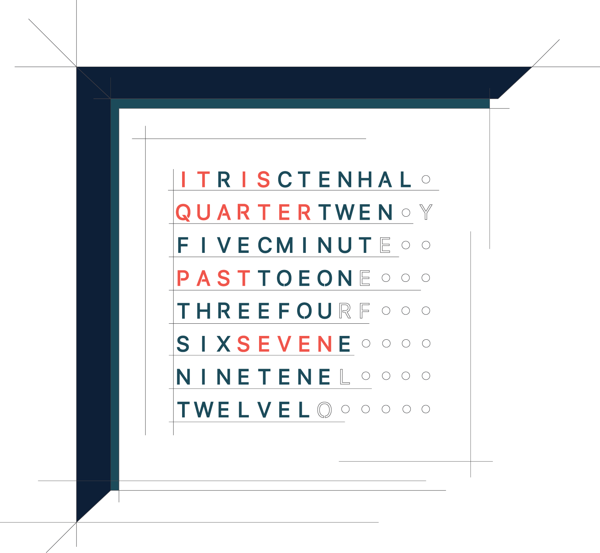

# Words Clock
A words clock controlled by a PIC16F690 8-bit processor.

*This project has been realised by Marcel Eschmann and Simone Stefani as part of the Embedded Electronic course (IE1206) at KTH Royal Institute of Technology (Stockholm) during spring 2016.*

  

A words clock is a device consisting of a display area where specific words appear according to the current time. A typical displayed phrase can be “IT IS TWENTY MINUTES PAST TWELVE” and every five minutes the time is updated. Two buttons allow the user to manually update hours and minutes.

Construction, electronic circuit and progam of the clock are accurately described in the [Words Clock Manual](wordclock_manual.pdf).
